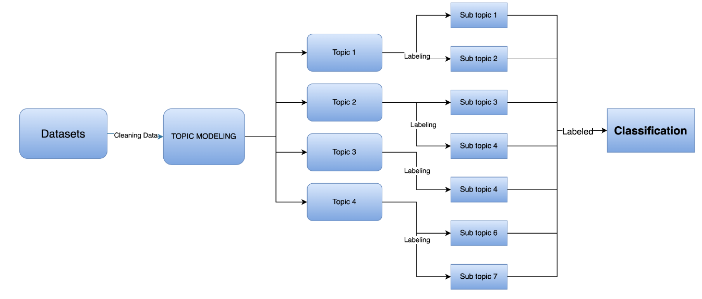
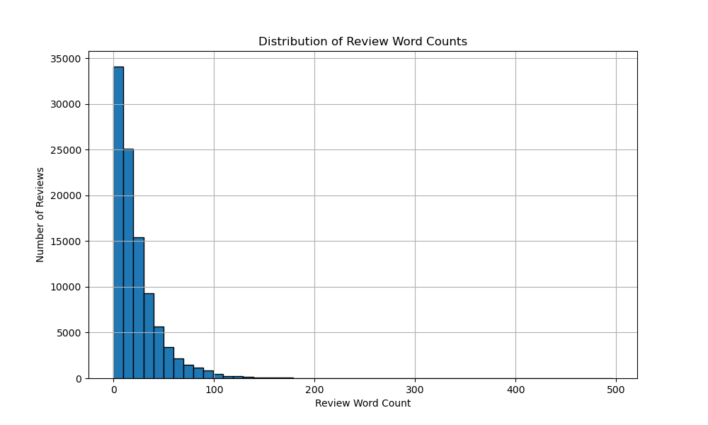
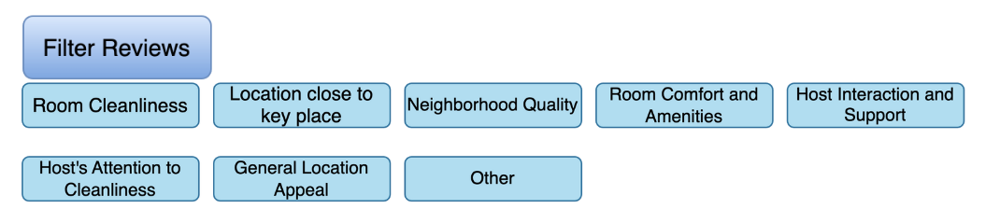

# Insightful Rviews
### Revealing Hospitality Review Insights

**Introduction** : In a world where customer feedback can make or break a hospitality business, how do we sift through thousands of reviews to find what truly matters?

## Problem Statement
In the hospitality sector, businesses often struggle to navigate through a sea of unstructured customer feedback from AIRBNB platforms. This feedback, while rich in insights, remains largely untapped due to its volume and complexity.

The inability to effectively analyze this feedback can lead to missed opportunities for service improvement, a lack of timely response to customer needs, and, ultimately, a potential decline in guest satisfaction and business profitability


## TARGET AUDIENCE

- Airbnb Corporate Team  :  Seeking actionable insights from customer feedback to enhance guest satisfaction and make informed decisions.

- Prospective Guests :  Looking for personalized recommendations tailored to their preferences and needs when choosing accommodation.


## METHODOLOGY


## Data Collection 
- Insight AIRBNB provides a rich dataset of guest feedback, encompassing diverse aspects of guest experiences in various types of accommodations globally `BANGKOK`
- Data from 07/04/2012-18/09/2023 , 30,0000 reviews


| Feature       | Dataset                               | Description                             |
|:----------------:|:-------------------------------------:|:--------------------------------------:|
| **listing_id**    | Revirews.csv | Unique to a specific property or rental listing. |
| **reviewer_id** | Revirews.csv  | ID of Users |
| **comments**  | Revirews.csv | Text of reviews     |
| **Date**  | Revirews.csv | Date of reviews   |


## EDA AND CLEANING 
- **Normalize Text** 
    - Replace/remove special characters (/, <, >, etc.)
    - Keep only English letters and numbers
- **Remove Stopwords and Common Words**
    - Remove English stopwords. (a, is, a, etc)
    - Filter out frequent but less informative words (e.g., 'good', 'great').
- **Data Ready for Analysis**
    - Proceed to topic modeling and further analysis.




## CONCLUSION and RECOMMENDATION 

- Topic Modeling Success: The project successfully implemented topic modeling (LDA) to categorize user reviews into distinct topics, enhancing the review classification system.
- Insights from Data: The analysis revealed various sub-topics within the reviews, such as Facilities, Cleanliness, Location, and Host Interaction, offering deep insights into customer preferences and experiences.
- Model Performance: Logistic Regression was found to be the most effective model with improved scores in F1, Recall, Precision, and Accuracy metrics.

## SUGGESTION 
- Implement Review Filtering on Airbnb
- Continuous Model Improvement
- Using Sub-labels for In-depth Customer Surveys
- Expansion to Other Languages: Given Airbnb's global presence, recommend expanding the model to include multiple languages, thereby making the review filtering feature universally applicable and useful.




## LIMITATION
- Language Limitation: The project currently only processes reviews in English 
- Computer Resource 

## FUTURE WORK
- Expand Language Processing

- Sentiment Analysis 

## Reference 
- AirBNB provide Data  http://insideairbnb.com/bangkok/


```python

```
